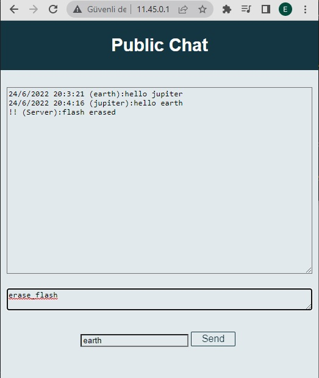
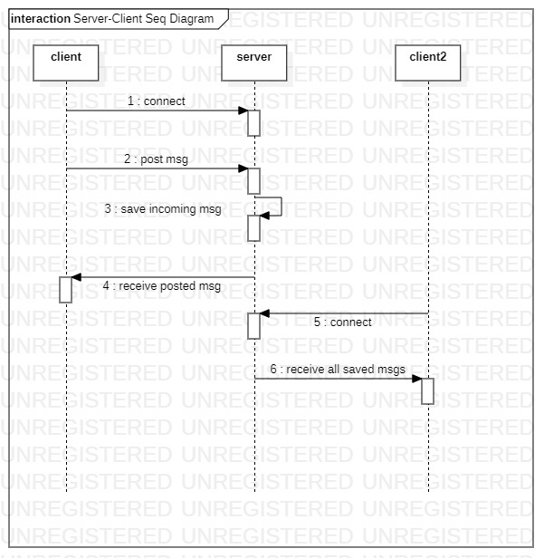

# ESP32ChatInCaptivePortal
Web-based public chat application in captive portal page via esp32 access point

## My Motivation
I thought it will be an interesting idea to create a publicly accessible chat via a free wifi access point with an intriguing ssid, especially for dormitories. In order to make the application easily accessible for the average internet user, I've used the captive portal by avoiding using an ip address.

## Requirements
- [ESPAsyncWebServer](https://github.com/me-no-dev/ESPAsyncWebServer) (for webserver and websocket)
- SPIFFS
- [ArduinoJson](https://arduinojson.org/) (to parse json string)

## Installation
- Change the maximum limit of message number in the queue in AsyncWebSocket.h, you cannot send the number of stored messages to the newly connected client more than this limit. The current limit is so low, 8 or 32. 

```
#define WS_MAX_QUEUED_MESSAGES 500 // send up to 500 previously stored messages to newly connected clients
```

- (Optional) You can set configurable things as you desire in chatAppInCaptivePortal.ino

```
// <-- advised configurable parameters --

const char* ssid = "Public Chat";
const char* password = "";

// when server get this message from any client, it will clear flash (delete saved messages)
// if you dont want this feature, comment out it.
#define SPECIAL_TEXT_TO_CLEAR_FLASH "erase_flash"

// -- configurable parameters -->
```
For example choose a special message to erase flash (not program, only stored messages) 

- (Optional) If you wish to modify html page, only index.h will be considered by compiler. Just change index.html and look what happens with a browser, then copy-paste codes to index.h

## Secreenshots


## Documentation
### Sequence Diagram


## Notable Features
- Connected clients can chat each other on a html page.
- It works on captive portal page with dns redirecting.
- Newly connected clients receive previous messages from other clients. (max limit must be configured because current limit is so low)
- If server gets the special text defined as preprocessor like "erase_flash", it will erase stored messages.
- Client's message size limit is configurable. However, it may be suppressed by websocket lib. If a client sends a message bigger than this limit, it will be warned by server.
- Max message size is restricted in html page of client. Textarea maxlimit is controlled by the server. 