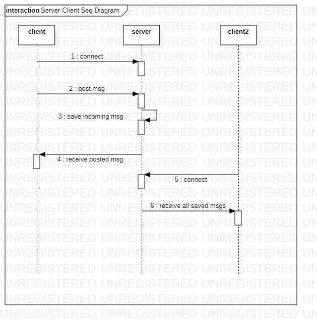

# ESP32ChatInCaptivePortal
Web-based public chat application in captive portal page via esp32 access point

## My Motivation
I thought it will be an interesting idea to create a publicly accessible chat via a free wifi access point with an intriguing ssid, especially for dormitories. In order to make the application easily accessible for the average internet user, I've used the captive portal by avoiding using an ip address.

## Requirements
- [ESPAsyncWebServer](https://github.com/me-no-dev/ESPAsyncWebServer) (for webserver and websocket)

## Documentation
### Sequence Diagram

